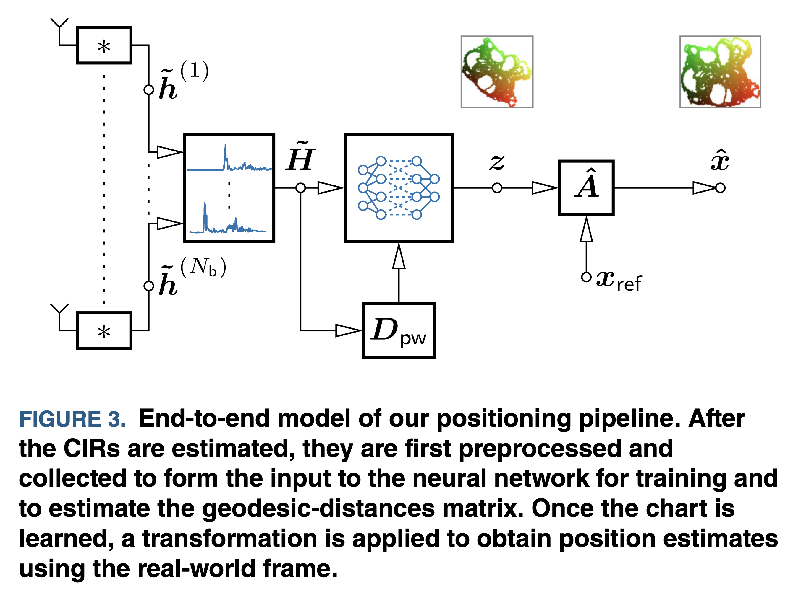

# Indoor Localization with Robust Global Channel Charting

The code for the paper "Indoor Localization with Robust Global Channel Charting: A Time-Distance-Based Approach".

## Reference

Please cite our work if you find our work useful for your research:
```
@article{stahlke2022indoor,  
    title={Indoor Localization with Robust Global Channel Charting: A Time-Distance-Based Approach},  
    author={Stahlke, Maximilian and Yammine, George and Feigl, Tobias and Eskofier, Bjoern M and Mutschler, Christopher},  
    journal={arXiv preprint arXiv:2210.06294},  
    year={2022}  
}
```

## Method



## Install

This code was tested on Python 3.8.5 with CUDA version 11.6. Clone the respository, navigate to the root level of the repository and install the package via pip:

```
pip install .
```

the datasets can be downloaded at ...

## Preprocessing

The datasets contain the complex CIR with ToF / TDoA information and ground truth information. To get the input embedding as described in chapter IV B, the preprocessing script can be used (variable "setup" can either be "5G" or "UWB"):

```
python scripts/preprocess.py --training-data-path {path to dataset}/{setup}_training_data.hdf5 --test-data-path {path to dataset}/{setup}_test_data.hdf5 --config-path {setup}_config.xml --output-folder {output folder for preprocessed data}
```

To estimate the geodesic distance matrix as described in chapter III B, the following script can be used:

```
python scripts/dist_matrix.py --data-path {output folder for preprocessed data}/training_data --output-path {output folder for distance matrix}
```

## Training

The channel chart can be trained using the following script:

```
python scripts/training.py --data-path {output folder for distance matrix} --model-name Model_{setup} --model-path {Model output path}
```

The names of the available models are "Model_UWB" for the uwb setup and "Model_5G" for the 5G setup. 

## Evaluation

After training, the channel chart can be evaluated using the following script:

```
python scripts/evaluation.py --data-path {output folder for preprocessed data}/{training or test}_data --model-name Model_{setup} --model-path {Model output path}--report-name {report folder}/{report_name}.pdf
```

The {report_name}.pdf contains the radio environment, the channel chart before transformation and after transformation. The key performance indicators are also printed in the console.

## Copyright 

Copyright (C) 2023

Fraunhofer Institute for Integrated Circuits IIS
<br>Nordostpark 84, 90411 Nürnberg

All rights reserved.

